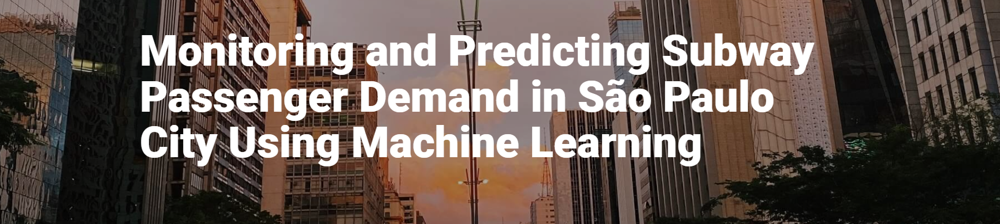

# SAO PAULO DEMAND PREDICTOR

<p align="center">
<a href=""></a>
</p>

## 🔨 The Problem

The São Paulo city subway system comprises 6 lines with 91 stations. Every day on average more than 4 million people are transported. Although the system is under continuous update with new lines and stations being constructed, the passenger demand is still higher than transportation capacity in critical times every day. Only recently in the last years, the data for passenger demand has been opened to public access. There is no open monitoring system, dashboards, or predictive models to help the people and community decision-makers to understand the evolution and forecast the passenger demand for better urban planning.

## 🔗 Project Goals

In this project, the Omdena São Paulo, Brazil Chapter team aims to develop a monitoring and predicting system for subway passenger demand using machine learning.With a duration of 5-weeks, this project aims to: - Data Collection and Preprocessing. - Exploratory Data Analysis - Data Visualization. - Model Development and Training. - Web App Development.

## 🔥 Demo

For quick demo, you can visit [the application](sp-trainway.streamlit.app/)

## 🔧 Installation

1. Clone the repository:
    ```sh
    git clone https://github.com/Santhosh-Kumar-02/Sao_Paulo_Predictor
    ```
2. Navigate into the project directory:
    ```sh
    cd sao_paulo
    ```
3. Install the necessary dependencies: 
    ```sh
    pip install -r requirements.txt
    ```

## 🎮 Usage

Once installed, you can use the app by running the following command:

```sh
streamlit run index.py
```

## 🤝 Contribute

Contributions to the  project are welcomed! Whether you're fixing bugs, improving the readme, or proposing new features, your efforts are highly appreciated. Please check the open issues before starting any work.


## 📜 License

Sao_Paulo_Predictor is an open-source project licensed under [MIT License](LICENSE).

---

For any issues, questions, or comments, please feel free to contact us or open an issue. We appreciate your feedback to make the app better.


